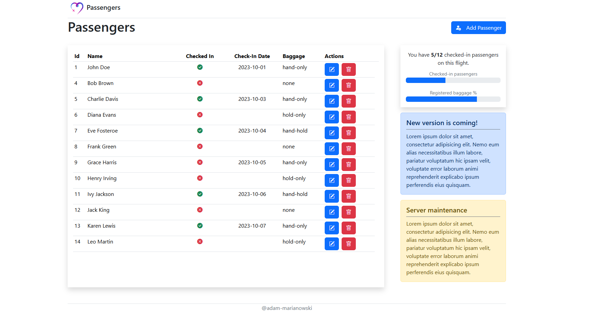
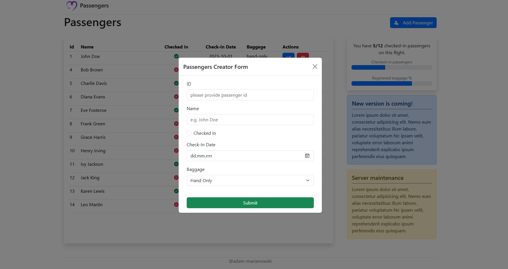
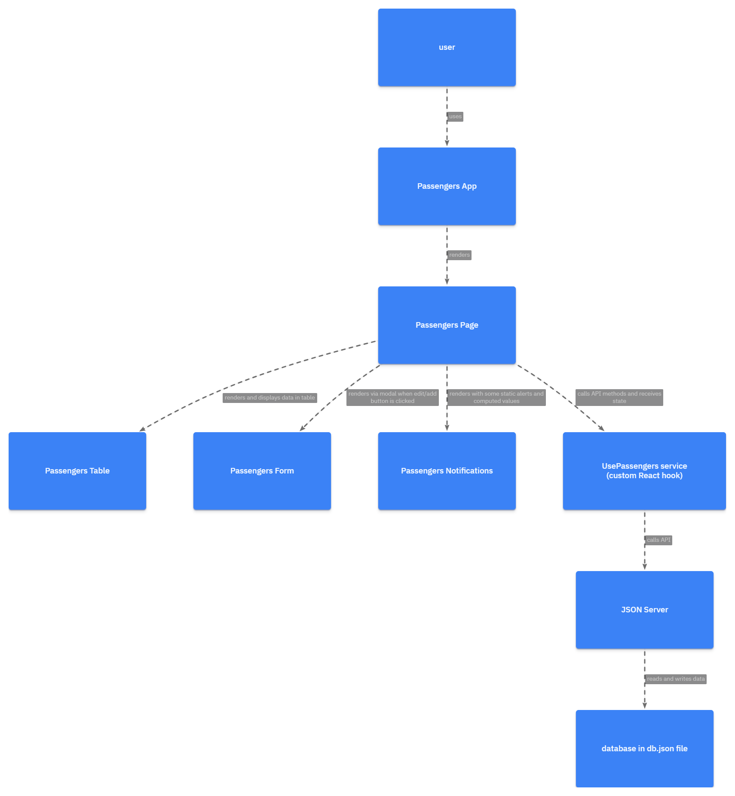

# React passengers


- Simple app for managing a list of passengers.
- Built with React (CRA) and TypeScript.
- API implemented using JSON-server.
- Styled with Bootstrap and Bootstrap Icons.

## Screenshots





## Design

This app is designed to be minimalistic, making it ideal for testing various React features.

- hard-coded strings and repetitions occur.
- Components are very simple. Application only renders header, table, notifications and forms.
- There is one component - `Passengers` which connects to the service (custom hook). All other components are only for rendering UI parts.
- All API-related logic is extracted to `usePassengers` to simplify the components even more.
- there is no typescript interfaces and types definitions apart of the `Passenger` `interface` which is global, living in `react-app-env.d.ts`.
- Forms are rendered in modal (`PassengersModal`) although URL is changing so the App can make call to server to externally fetch selected Passenger.

## Architecture



- `usePassengers` is built for dealing with data-related state and makes API calls. It returns all functions which are essential for the app. It also provides `passengers` `state` and exposes `selectedPassenger` when one is ordered to be fetched.
- on initialization `usePassengers` will fetch all Passengers from the API:

```ts
const getPassengers = () => {
  fetch("http://localhost:4000/passengers")
    .then(res => res.json())
    .then(data => setPassengers(data))
    .catch(err => console.error(err));
};

useEffect(() => {
  getPassengers();
}, []);
```

- App is built in very simple manner.
- `Index` is entry file for the App. It also imports `Bootstrap`-related files.
- `App` is only rendering `header`, `footer` and one component - `Passengers`. There is need for routing paths.
- `Passengers` is rendering different parts of the UI and provides import from `usePassengers` as `service` which handles all use-cases required by other components.

```ts
const Passengers = () => {
  const service = usePassengers();
};
```

## Components

- **PassengersTable** - receives list of passengers from `Passengers` component. Lists all passengers and informs `Passengers` when user clicks on `edit passenger` or `remove passenger` buttons. Then `Passengers` can respond by calling remove function from `service` or bootstrap `modal` will be triggered to open `Editor form`.

```tsx
// on edit/remove action Passengers component is calling appropriate service methods
<section className="d-flex gap-5" style={{ maxHeight: "90vh" }}>
  <PassengersTable
    passengers={service.passengers}
    onRemovePassenger={service.removePassenger}
    onEditPassenger={service.getPassenger}
  />
  <PassengersNotifications passengers={service.passengers} />
</section>
```

```tsx
// this button will cause Passengers component to respond
<button
  aria-label="remove"
  className="btn btn-danger ms-2"
  onClick={() => props.onRemovePassenger(passenger.id)}
>
  <i className="bi bi-trash"></i>
</button>
```

- **PassengersNotifications** - This is very simple component. Which takes `passengers[]` computes different values: percentage of registered baggages, percentage of checked-in passengers and also displays some placeholder values for bootstrap `alerts`.

- **PassengersModal** - Bootstrap `modal` component. It takes children as prop to display appropriate form. This is used by `Passengers` to display `Editor` and `Creator` forms whenever appropriate button is clicked. Button is triggering modal via `data-bs-toggle` and is picked up by dialog according to its `id`. See [Bootstrap v.5.3 Modal Reference](https://getbootstrap.com/docs/5.3/components/modal/)

- **PassengersForm** - Form with controlled inputs. Everything is handled by `handleChange` and submit event by `handleSubmit` which then sends passenger obtained via this form to `Passengers` component, which in return will call `service` methods (edit, delete or create)

- **Passengers** - main container component. It exposes `service` logic to be picked up by different event handlers by calling appropriate `usePassengers` hook methods. It renders other UI components. It contains button for adding new passenger which has attribute of `data-bs-toggle` to execute `show()` on bootstrap `Modal`.

## Typescript

- Typescript `interface` is living in `react-app-env.d.ts` and is globally available as used by nearly all components.

## Mock API

- this app has built API with JSON-server.
- JSON-server must be running alongside the app and it stores state of the databse in `db.json` file.
- `package.json` refers to the port on which `JSON-server` is listening.
- all API calls are being made from `usePassengers` hook.

## Installation

To run this project locally, follow these steps:

1. Clone the repository:
   ```bash
   git clone https://github.com/yourusername/react-passengers.git
   ```
2. Navigate to the project directory:
   ```bash
   cd react-passengers
   ```
3. Install the dependencies:
   ```bash
   npm install
   ```
4. Start the JSON server:
   ```bash
   npm run server
   ```
5. Start the React application:
   ```bash
   npm start
   ```

## Usage

Once the application is running, you can:

- View the list of passengers.
- Add a new passenger.
- Edit an existing passenger's details.
- Delete a passenger from the list.
